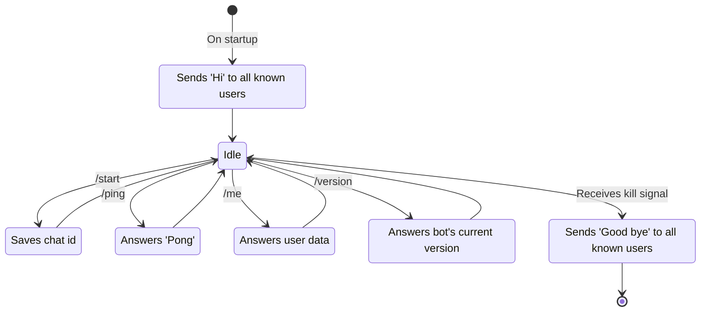

# Transmission telegram rust (ttr) bot

Configurable bot to help your server

## Development

### Enable variables from .env

```bash
export $(cat .env | xargs)
```

## List of commands

Copy this to [@botfather](https://telegram.me/BotFather) when editing list of commands:

```text
version - Command to display current bot version
ping - Simple ping command
```

## Abilities

- [x] Ability to receive commands from telegram and show help

- [ ] Send command on startup

- [ ] Ability to receive messages and execute arbitrary code

- [ ] Ability to receive files after some dialog

- [ ] Receive commands via stdin or something like that from other programs (i.e. executed via cron)

## Dialogues state diagram


